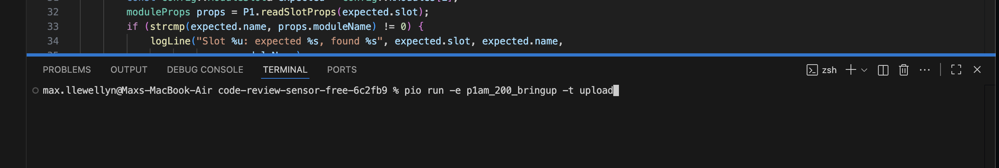
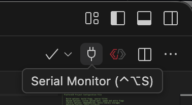
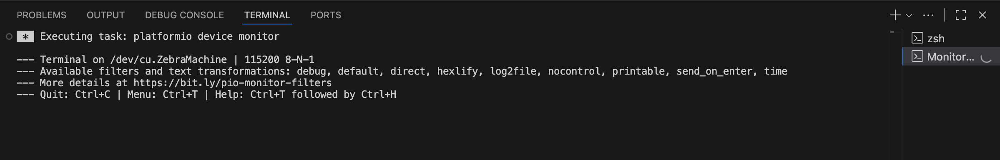

# Smore Bot

This code runs the smore making robot.

## 1. Get set up

1. Install VS Code and PlatformIO by following this guide:
   https://platformio.org/install/ide?install=vscode
2. In VS Code, choose **File > Open Folder** and open the `smore-bot` folder.
3. Wait for PlatformIO to finish loading. The first time takes a few minutes.

## 2. Send the code to the robot

1. Turn on the robot's 24V power.
2. Plug the controller into your computer with a USB cable.
3. Click the New Terminal button from the PlatformIO quick actions menu. The default terminal will not have the pio command in it's path.


4. Type this command and press Enter:

   ```
   pio run -e p1am_200 -t upload
   ```

5. Wait for the word `SUCCESS`. If you see `FAILED`, go to part 4.



## 3. Open the serial monitor

The serial monitor shows messages from the robot.

1. Click the plug button at the top right of VS Code.

   

2. The robot's messages appear.

   

   This picture shows the monitor trying to connect with no board plugged in.
   With the robot plugged in, you also see its messages.

3. To send a command, type it and press Enter.
4. To close the monitor, click in it and press **Ctrl+C**.

**Close the monitor before you send new code.**

## 4. If sending the code fails

Try these one at a time:

1. Close the serial monitor.
2. Unplug the USB cable, wait 5 seconds, and plug it back in.
3. Try a different USB cable or USB port. Some cables only charge.
4. Check that the robot's 24V power is on.
5. Press the small reset button on the controller two times fast. Then send the
   code again.
6. Close VS Code, open it again, and try again.

## 5. Test the wiring

Debug mode lets you check each part of the robot, one at a time, instead of
running the whole line.

1. Type `debug` and press Enter. The robot stops and prints `Debug mode`.
2. Every 5 seconds it shows a line like this:

   ```
   start:ON  cancelCook:off  mmExit:off  run:off  oven:72F
   ```

   Press the start button. The next line says `start:ON`. Try the same with
   the marshmallow sensor (`mmExit`) and the run switch (`run`).

3. **Keep your hands clear. The station moves as soon as you press Enter.**

   Type a station name and press Enter:

   | Name | Station |
   | --- | --- |
   | `belt` | Conveyor belt |
   | `gc1` | First graham cracker |
   | `ch` | Chocolate |
   | `mm` | Marshmallow |
   | `oven` | Oven |
   | `gc2` | Top graham cracker |

   A station finishes its whole move once it starts. `gc2` takes about 24
   seconds.

4. Type `debug` again. It prints `Smore mode` and runs the robot normally.

Every 15 seconds the serial monitor prints `Debug mode` or `Smore mode`, so
you can always tell which one the robot is in.

## 6. Run the robot

**Keep your hands clear while the robot runs. The oven gets hot.**

1. Flip the run switch on. It is the small switch on the controller. The belt
   starts.
2. Wait for the ready light. Press the start button to make a smore. The light
   goes out and the robot waits 1 second before moving, so step back.
3. Flip the run switch off to stop.
4. Take everything off the belt before you turn it back on.
5. Type `status` in the serial monitor to see what each station is doing.
6. Type `cancel cook` to stop the oven early and let the tray move on. This
   only does anything while the oven is actually toasting. A cancel cook
   button does the same thing once one is wired in (see `include/Config.h`).

**To stop in an emergency, press the e-stop button.**

## 7. Read the status lights

Once the light strip is wired in, the lights along the belt show what each
station is doing:

| Lights | Meaning |
| --- | --- |
| Blue | Waiting for its turn |
| Green band moving | Waiting for the tray to arrive |
| Pulsing green | Working |
| Solid green | Finished, tray still there |
| Blue band moving | The tray is leaving |

The oven uses red where the others use green, and pulses faster. The belt
lights are blue when the belt is stopped and pulse green while it runs.

The colors, speeds and light counts are in `include/Config.h`.

## 8. Change timings

Times are in `include/Config.h`. `1000` means 1 second.

## 9. Run the tests

This checks the robot's logic on your computer. The robot does not need to be
plugged in.

```
pio test -e native
```

## More help

[P1AM documentation](https://facts-engineering.github.io/)
